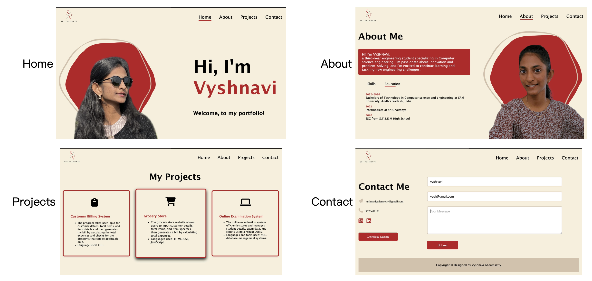

# Student Portfolio Website

## Description
This project is a personal portfolio website built using **HTML**, **CSS**, and **JavaScript**. It highlights my skills, academic achievements, projects, and provides a professional online presence. The website is designed to be responsive, visually appealing, and interactive, showcasing my web development skills.

## Project Overview
The goal of this project is to create a platform where I can present my professional portfolio to potential employers, clients, academic institutions, and peers. The website includes sections for **About Me**, **Projects**, **Skills**, and **Contact Information**. It is optimized for performance, security, and SEO to ensure a seamless experience across devices.

## Features
- **Interactive Elements**: Includes dynamic features such as project galleries, animations, and a functional contact form for user interaction.
- **Performance Optimization**: Images are optimized, and CSS and JavaScript files are minified for faster load times.
- **SEO-Friendly**: The use of semantic HTML and meta tags enhances search engine visibility.

## Technologies Used
- **HTML5**: Structure and content.
- **CSS3**: Styling and layout (using Flexbox and Grid).
- **JavaScript**: Interactivity and dynamic content.
- **GitHub Pages**: Hosting the website.
- **Figma**: Prototyping and wireframing.

## Setup and Installation
1. Clone the repository:
   ```bash
   git clone https://github.com/vyshnaviGadamsetty/student_portfolio.git
   ```
2. Navigate to the project directory:
   ```bash
   cd student_portfolio
   ```
3. Open the `main.html` file in your browser to view the website.

## Usage
- Visit the **Home** page to get an overview of my profile.
- Explore the **Projects** section to see detailed descriptions of the projects I’ve worked on.
- Contact me through the **Contact Form** for any inquiries or opportunities.

## Customization
- Personal background image, color scheme, and logo reflect my personal brand.
- Wireframes and interactive prototypes were created using **Figma** to enhance the user experience.

## Portfolio Overview
This is an overview of the portfolio website showcasing the following sections:
- Home
- About Me
- Projects
- Contact



## Contributions
Contributions, feedback, and suggestions are welcome! Feel free to fork the repository and submit pull requests.

---

This README includes essential information about the project, its features, and instructions for users or potential collaborators to set it up and contribute.

